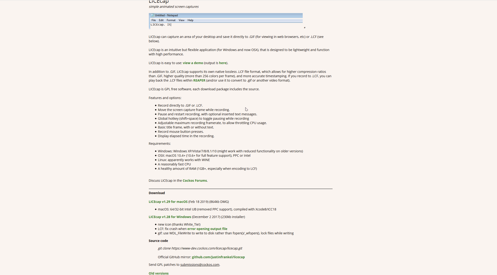
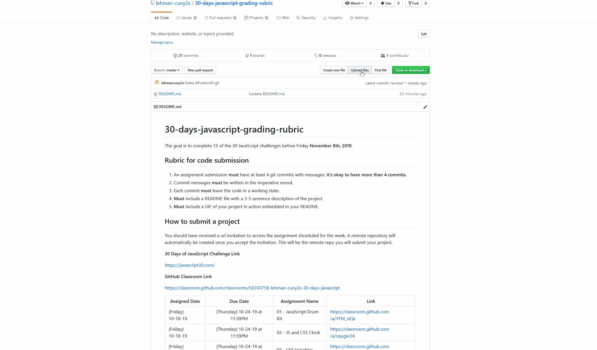

# 30-days-javascript

The goal is to complete 15 of the 30 JavaScript challenges before Friday **November 8th, 2020**.

## Rubric for code submission
 1. Every assignment submission **must** have at least 4 git commits with messages. **It's okay to have more than 4 commits.**
 2. Commit messages **must** be written in the imperative mood.
 3. Each commit **must** leave the code in a working state.
 4. **Must** include a README file with a 3-5 sentence description of the project.
 5. **Must** include a GIF of your project in action embedded in your README.

  
  
  ## Where to submit a project
  
  You should have your own GitHub remote repository. If you don't, create one. You will find Git and GitHub resources below that will help you submit your project. 
 
 **30 Days of JavaScript Challenge Link**
 
 https://javascript30.com/
  

**Week 1**

| Assignment Name  
| ------------- |
| 01 - JavaScript Drum Kit |
| 02 - JS and CSS Clock |
| 03 - CSS Variables |

**Week 2**

| Assignment Name  |
| ------------- |
| 04 - Array Cardio Day 1 | 
| 05 - Flex Panel Gallery |
| 03 - 29 - Countdown Timer |
| 30 - Whack A Mole |

## Git and GitHub Resources

Slides:

- [Git and GitHub Slides - Part I](https://docs.google.com/presentation/d/12tgnThkuKGHpbxZEv2RTWOTLpViL1O3hcHEGNJv9Wzo/edit?usp=sharing)
- [Git and GitHub Slides - Part II](https://docs.google.com/presentation/d/1Qkz1Z83P2b2EUFDrMN8L1X7BcMwZzzkSqCKCI8INH78/edit?usp=sharing)

Resources:

- [Git Codecademy Tutorial](https://www.codecademy.com/learn/learn-git)
- [Writing good commit messages](https://medium.com/compass-true-north/writing-good-commit-messages-fc33af9d6321)
- [Learn Git Branching](https://learngitbranching.js.org/)
- [Advanced Git Workflow](https://www.atlassian.com/git/tutorials/comparing-workflows)

## HTML, CSS, JavaScript Resources

 Topic        | Link         |
| ------------- |:-------------:|
| HTML | https://developer.mozilla.org/en-US/docs/Web/HTML| 
| CSS | https://developer.mozilla.org/en-US/docs/Web/CSS | 
| JavaScript | https://developer.mozilla.org/en-US/docs/Web/JavaScript| 

## How to make a GIF in Windows and Mac ##

**Download LICEcap from** https://www.cockos.com/licecap/

**How to add GIF to README**

